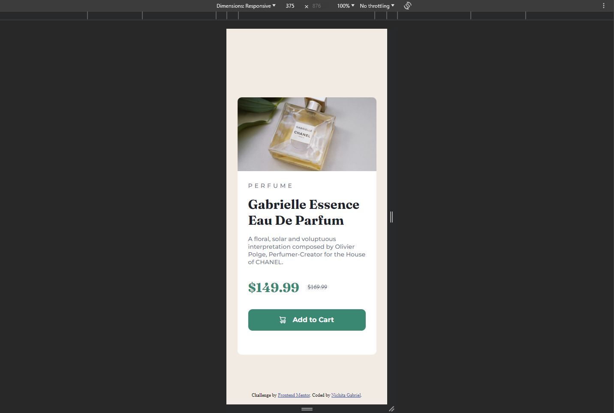

# Product-preview-card-component
I had to build out a product preview card component and get it looking as close to the design as possible.

# Frontend Mentor - Interactive rating component solution

This is a solution to the [Interactive rating component challenge on Frontend Mentor](https://www.frontendmentor.io/challenges/interactive-rating-component-koxpeBUmI). Frontend Mentor challenges help you improve your coding skills by building realistic projects. 

## Table of contents

- [Overview](#overview)
  - [The challenge](#the-challenge)
  - [Screenshot](#screenshot)
  - [Links](#links)
- [My process](#my-process)
  - [Built with](#built-with)
- [Author](#author)

## Overview

### The challenge

Users should be able to:

- View the optimal layout depending on their device's screen size
- See hover and focus states for interactive elements

### Screenshot

Desktop

Mobile

### Links

- [Solution URL](https://github.com/NichitaGabriel/Product-preview-card-component)
- [Live Site URL](https://nichitagabriel.github.io/Product-preview-card-component/)

## My process

### Built with

- HTML5
- CSS
- Flexbox
- Mobile-first workflow

## Author

- Website - [Nichita Gabriel](https://github.com/NichitaGabriel)
- Frontend Mentor - [@nichitagabriel](https://www.frontendmentor.io/profile/NichitaGabriel)
